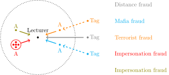

# projet3A

## Introduction

This project is about checking events attendees presence.

## Properties

### Usage

The solution should :

1. be easy to use for lecturers;
1. support ~150 simultaneous users;
1. have a range of 150m;
1. require few user inputs;
1. be usable over a day;
1. ensure the unique and effective presence of a user.

### Privacy

The solution should :

1. only be tracking users during the event;
1. respect GDPR;
1. have an anonymous mode.

## Distance-bounding

To prevent the following attacks, we are using a distance-bounding protocol.

### Attacks

  

- *Distance fraud* : A tag outside of the zone manages to be verified.
- *Mafia fraud* : An honest tag communicates with the lecturer via a man-in-the-middle involving a malicious receiver and tag.
- *Terrorist fraud* : A dishonest tag communicates with another dishonest tag.
- *Impersonation fraud* : Someone in the zone is verified via someone else's tag, or gets multiple people verified.

### Swiss-Knife over Wi-Fi and Audio (SKoWA)

We use the [Swiss-Knife protocol](http://www.avoine.net/rfid/download/papers/KimAKSP-2008-icisc.pdf) over Wi-Fi and audio. The second phase (rapid bit exchange) cannot be done via traditional Wi-Fi systems because it is too fast to measure distance with ~10 meters accuracy.

## References

    
Avoine, Gildas, Muhammed Bingöl, Süleyman Kardaş, Cédric Lauradoux, and Benjamin Martin. 2009. “A Formal
        Framework for Cryptanalyzing Rfid Distance Bounding Protocols.” <em>IACR Cryptology ePrint Archive</em> 2009
        (January): 543.

    
Brands, Stefan, and David Chaum. 1994. “Distance-Bounding Protocols.” In <em>Workshop on the Theory and
            Application of Cryptographic Techniques on Advances in Cryptology</em>, 344–59. Springer-Verlag.

    
Kim, Chong Hee, and Gildas Avoine. 2008. “The Swiss-Knife Rfid Distance Bounding Protocol.” In <em>In Icisc</em>,
        98–115. Springer.

    
Wikipedia contributors. 2019. “Distance-Bounding Protocol — Wikipedia, the Free Encyclopedia.” <a
            href="https://fr.wikipedia.org/wiki/Distance-bounding_protocol">https://fr.wikipedia.org/wiki/Distance-bounding_protocol</a>.
    

